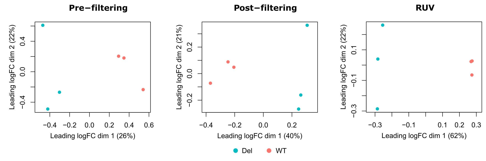
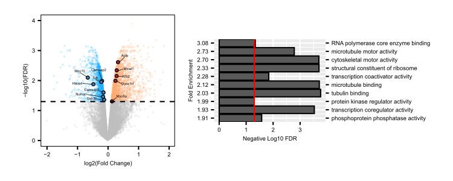
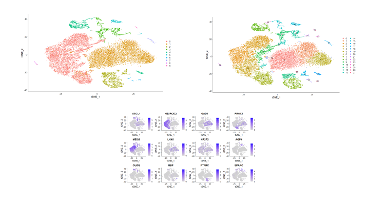
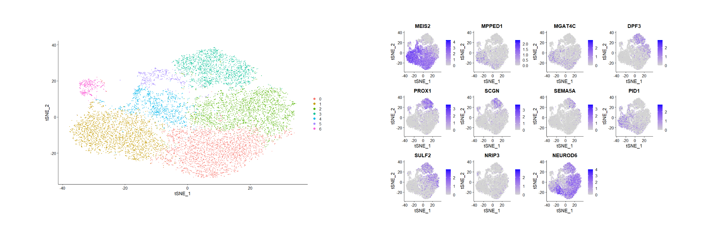
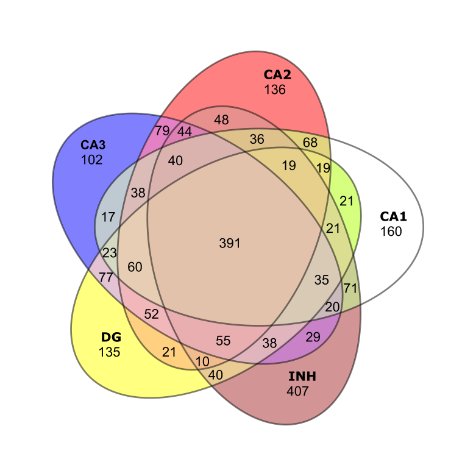
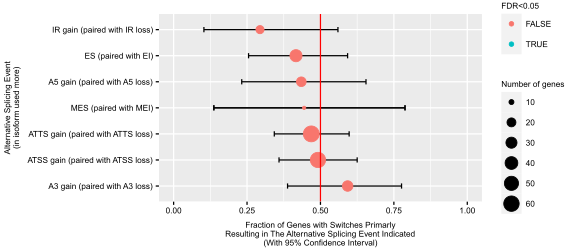

Analysis of bulk RNA seq and sc-RNA seq data for https://doi.org/10.1186/s12915-025-02138-6.

The pipeline for analyzing bulk RNA-seq data was built on the code from [Jenny Drnevich](https://orcid.org/0000-0002-1401-8311)

I used Selective Alignment method of Salmon (v1.4.0) with a decoy-aware transcriptome using the entire GRCm39 genome as the decoy to estimate expression level of each transcript. These data were normalized using TMM (trimmed mean of M values) normalization in the edgeR (v3.32.1) package retaining genes with expression ≥0.25 CPM in at least 3 samples (Post-filtering plot below). Then, I used RUVSeq (v1.24.0) package for the surrogate variables analysis to control the effects of outlying samples, and as a result, I obtained better separation of samples by genotype than filtering only (RUV plot below). 

Then I performed the differential gene expression analysis using the limma-trend method in limma (v3.46.0). I calculated two surrogate variables from RUVSeq and included them in the statistical model as covariates to control unwanted noise. Finally, I used one-way ANOVA test for the pairwise comparisons between the two groups. Multiple testing correction was done using the False Discovery Rate method. I exported the list of genes with significantly changed expression level, and performed the gene ontology analysis using [PANTHER](https://pantherdb.org/).

Because bulk RNA-seq represents an average across the entire hippocampus, I complemented this with single-cell RNA-seq data to assess regional specificity of the DEGs. I obtained single-cell sequencing data from [Zhong et al., 2020](https://www.nature.com/articles/s41586-019-1917-5) because they showed high correlation of gene expression between hippocampi of human embryos and neonatal mice. First, I replicated Figure 1B and 1C from the paper by analyzing the sc-seq data using Seurat (v4.0.3).

While I used the parameters reported in the paper, I couldn't replicate the clustering identically probably because of the newer package version and unreported parameters. Nevertheless, using the markers shown in Figure 1C, I identified the cluster with excitatory neurons and performed clustering analysis on them only, replicating Figure 3A. As a result, I got clusters that represent different regions of hippocampus, and using the markers reported in the paper, I could identify which clusters represented CA1, CA2, CA3, and Dentate gyrus.

After that,  I exported the list of genes expressed by the cells that belonged to each cluster, and assessed how many of my previously identified DEGs were expressed in those clusters. I saw high levels of overlap between genes exported from the clusters and my DEGs, with no enrichment to any region. This result prompted me to look how many genes hippocampal regions share with each other. As a result, I observed a high overlap between these genes, suggesting that hippocampal regions express very similar set of genes, but at different levels, which results in specific identity of the region.

Finally, the depth of the bulk RNA-seq data allowed me to perform alternative splicing analysis, which I did using IsoformSwitchAnalyzeR (v 1.12.0) but didn't find any interesting results.

